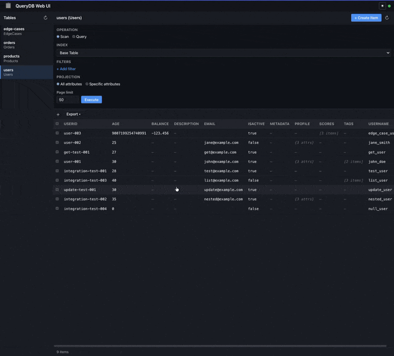

<h1 align="center">🔍 QueryDB</h1>
<h4 align="center">A CLI & Web Explorer for DynamoDB</h4>

<p align="center">
  <a href="#-about">About</a> •
  <a href="#%EF%B8%8F-quickstart">Quickstart</a> •
  <a href="#-installation">Installation</a> •
  <a href="#-features">Features</a> •
  <a href="#%EF%B8%8F-configuration">Configuration</a> •
  <a href="#-cli-usage">CLI Usage</a> •
  <a href="#-web-explorer">Web Explorer</a> •
  <a href="#-development">Development</a>
</p>

---

> "I am not a machine."
>
> Hal Incandenza

<p align="center">
  
</p>

---

## 📖 About

A command-line interface and web-based explorer for querying DynamoDB tables, built for local development with LocalStack and production AWS environments.

---

## ⚡️ Quickstart

1. Run `querydb` to create a sample configuration.

2. Edit `~/.config/querydb/config.yaml`:
   ```yaml
   tables:
     products-table:
       table_name: "Products"
       endpoint: "http://localhost:8000"
       region: "us-east-1"
       access_key_id: "foo"
       secret_access_key: "bar"
   ```

3. Query your table:
   ```shell
   querydb products-table
   ```

4. Start the Web Explorer:
   ```shell
   querydb serve
   # Open http://localhost:3030
   ```

---

## 🤖 Installation

This project uses [goreleaser](https://goreleaser.com/) to generate executables for the major operating systems. Just go to the releases page and download yours and move it somewhere that your PATH knows to look for.

Or, if knowing your OS and architecture + downloading a file + running a `mv` command is just too much for you. You can always use [🦊 fox](https://www.getfox.sh) to install.

Just run:

```shell
fox install querydb
```

### Build from source

```bash
goreleaser release --snapshot --clean
```

### Quick install script

```bash
chmod +x install.sh
./install.sh
```

---

## 🎉 Features

### CLI
- Store table configurations in YAML
- Config-based and flag-based queries
- Optimized for local DynamoDB development with LocalStack
- Works with production AWS DynamoDB
- Automatic DynamoDB type conversion to readable formats
- Handles large datasets with automatic pagination
- Descriptive error messages with troubleshooting suggestions
- Pretty-printed JSON with summary information

### Web Explorer UI
- Toggle between Scan and Query operations, select indexes (GSI/LSI), set key conditions with sort key operators (=, <, <=, >, >=, between, begins_with)
- Visually build DynamoDB filter expressions with attribute name, type, condition, and value fields — no raw expressions needed
- Choose between all attributes or a specific subset via projection selector
- Auto-generated columns with key attributes first, DynamoDB type badges (S, N, BOOL, NULL, M, L, SS, NS, BS, B), inline editing for scalar values, JSON modal for complex types
- "Load more" pagination using DynamoDB LastEvaluatedKey
- Scanning statistics: items returned, items scanned, consumed capacity units
- Create items via JSON editor modal with key attribute template
- Multi-select with checkboxes, bulk delete with confirmation, bulk duplicate with key modification
- Export current result set as CSV or JSON
- Typed value serialization that preserves DynamoDB type information across the API boundary

---

## ⚙️ Configuration

Located at `~/.config/querydb/config.yaml`:

```yaml
tables:
  products-table:
    table_name: "Products"
    endpoint: "http://localhost:8000"
    region: "us-east-1"
    access_key_id: "foo"
    secret_access_key: "bar"

  users-table:
    table_name: "users"
    endpoint: "http://localhost:4566"
    region: "us-west-2"

  prod-users:
    table_name: "production-users-table"
    endpoint: "https://dynamodb.us-east-1.amazonaws.com"
    region: "us-east-1"
```

### Data Type Conversion

| DynamoDB Type | Converted To | Example |
|---------------|--------------|---------|
| S (String) | string | `"hello world"` |
| N (Number) | number | `123` or `45.67` |
| BOOL (Boolean) | boolean | `true` / `false` |
| NULL | null | `null` |
| L (List) | array | `["item1", "item2"]` |
| M (Map) | object | `{"key": "value"}` |
| SS (String Set) | array | `["str1", "str2"]` |
| NS (Number Set) | array | `[123, 456]` |
| BS (Binary Set) | array | `["binary1", "binary2"]` |

---

## 💻 CLI Usage

### Configuration-Based (Recommended)

```shell
querydb products-table
querydb users-table
```

### Flag-Based (Ad-hoc)

```shell
querydb --table my-table --endpoint http://localhost:8000

querydb --table users \
  --endpoint http://localhost:4566 \
  --region us-west-2 \
  --access-key mykey \
  --secret-key mysecret
```

### Mixed (Override Config)

```shell
querydb products-table --endpoint http://localhost:4566
querydb users-table --region us-west-1
```

### CLI Flags

| Flag | Short | Description | Default |
|------|-------|-------------|---------|
| `--table` | `-t` | DynamoDB table name | - |
| `--endpoint` | `-e` | DynamoDB endpoint URL | `http://localhost:8000` |
| `--region` | `-r` | AWS region | `us-east-1` |
| `--access-key` | - | AWS access key ID | `foo` (LocalStack) |
| `--secret-key` | - | AWS secret access key | `bar` (LocalStack) |
| `--config` | - | Custom config file path | `~/.config/querydb/config.yaml` |
| `--output` | `-o` | Output format | `json` |

---

## 🌐 Web Explorer

Start the web server:

```shell
querydb serve                          # Default: localhost:3030
querydb serve --port 9090              # Custom port
querydb serve --host 0.0.0.0           # Bind to all interfaces
querydb serve --host 0.0.0.0 --port 9090 --config ./my-config.yaml
```

### Serve Flags

| Flag | Short | Description | Default |
|------|-------|-------------|---------|
| `--port` | `-p` | Port to run the server on | `3030` |
| `--host` | `-H` | Host address to bind to | `127.0.0.1` |
| `--config` | - | Custom config file path | `~/.config/querydb/config.yaml` |

### API Endpoints

| Method | Endpoint | Description |
|--------|----------|-------------|
| GET | `/api/tables` | List configured tables |
| GET | `/api/tables/{name}/items` | Scan all items (legacy) |
| GET | `/api/tables/{name}/describe` | Get table metadata (key schema, indexes) |
| POST | `/api/tables/{name}/query` | Execute a DynamoDB Query |
| POST | `/api/tables/{name}/scan` | Execute a DynamoDB Scan with filters |
| POST | `/api/tables/{name}/items` | Create item |
| PUT | `/api/tables/{name}/items/{key}` | Update item |
| DELETE | `/api/tables/{name}/items/{key}` | Delete item |

The `/query` and `/scan` endpoints use a typed value format that preserves DynamoDB type information:

```json
{
  "pk": {"value": "user-123", "type": "S"},
  "age": {"value": "25", "type": "N"},
  "active": {"value": true, "type": "BOOL"}
}
```

---

## 🌍 Environment Setup

### LocalStack

```shell
# Start LocalStack
docker run --rm -it -p 4566:4566 -p 8000:8000 localstack/localstack

# Create a test table
aws dynamodb create-table \
  --table-name Products \
  --attribute-definitions AttributeName=productId,AttributeType=S AttributeName=category,AttributeType=S \
  --key-schema AttributeName=productId,KeyType=HASH AttributeName=category,KeyType=RANGE \
  --billing-mode PAY_PER_REQUEST \
  --endpoint-url http://localhost:8000

# Query with CLI
querydb products-table

# Or use the Web Explorer
querydb serve
```

### AWS Production

Configure credentials via `~/.aws/credentials`, environment variables, or IAM roles. Don't include credentials in the config file for production.

---

## 🔧 Troubleshooting

- **Connection Issues**: Ensure LocalStack is running, check endpoint URL
- **Authentication**: Use `foo`/`bar` for LocalStack, proper IAM for AWS
- **Table Not Found**: Verify table name, endpoint, and region
- **Config Issues**: Check YAML syntax, ensure required fields are present

---

## 🛠 Development

### Project Structure

```
querydb/
├── cmd/                           # CLI commands (Cobra)
│   ├── root.go                    # Root command and configuration
│   ├── query.go                   # Query subcommand
│   └── serve.go                   # Web server command
├── internal/
│   ├── config/                    # Configuration management
│   ├── dynamodb/                  # DynamoDB client (Scan, Query, Describe)
│   ├── errors/                    # Structured error handling
│   ├── formatter/                 # Output formatting
│   └── server/                    # HTTP server and handlers
│       ├── handlers.go            # API handlers + typed value serialization
│       ├── server.go              # Server setup and routing
│       ├── middleware.go          # CORS, logging, recovery
│       ├── embed.go               # Embedded static assets
│       └── web/                   # Frontend (embedded into binary)
│           ├── index.html
│           ├── css/styles.css
│           └── js/
│               ├── api.js         # API client
│               ├── app.js         # App initialization
│               ├── browser.js     # Data selection, result table, bulk ops
│               ├── editor.js      # Item detail editor
│               ├── export.js      # CSV/JSON export
│               └── tables.js      # Table list sidebar
├── .goreleaser.yaml               # GoReleaser configuration
├── main.go
└── go.mod
```

### Just Commands

This project uses [just](https://github.com/casey/just) as a command runner. Install it with `fox install just` or see the [installation docs](https://github.com/casey/just#installation).

| Command | Description |
|---------|-------------|
| `just test` | Run all tests |
| `just test-v` | Run tests with verbose output |
| `just test-unit` | Run unit tests only (skip integration) |
| `just test-integration` | Run integration tests (requires dynamodb-local) |
| `just test-property` | Run property-based tests |
| `just test-full` | Start db, seed data, and run all tests |
| `just db-up` | Start dynamodb-local container (idempotent) |
| `just db-down` | Stop dynamodb-local container (idempotent) |
| `just db-seed` | Seed test data into dynamodb-local |
| `just db-clean` | Clean test data from dynamodb-local |
| `just build` | Build the binary to `dist/querydb` |
| `just install` | Build and install querydb to `/usr/local/bin` |
| `just release-snapshot` | Run goreleaser in snapshot mode (no publish) |
| `just release` | Run goreleaser for real (requires git tag) |
| `just vet` | Run `go vet` |
| `just tidy` | Run `go mod tidy` |
| `just clean` | Remove build artifacts |

Run `just --list` to see all available commands.

---

## 📄 License

MIT License. See [LICENSE](LICENSE) for details.
